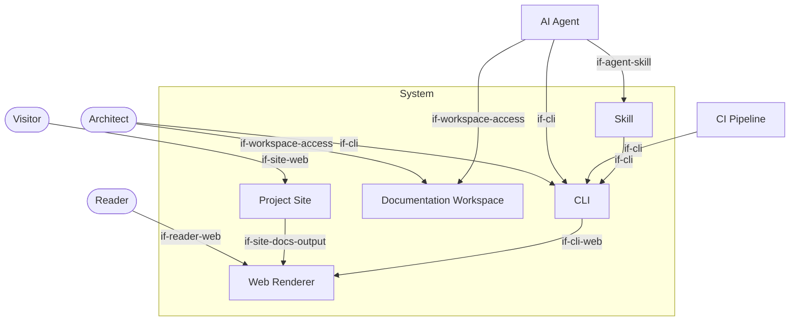

# System Scope and Context

The biz42 toolchain sits at the boundary between human architects, AI agents,
CI pipelines, and the files they all read and write. The system boundary is the CLI and
the core library. Everything else is external.

```arc42
:::diagram
id: diag-context
view: context
notation: mermaid
:::
```



---

## Architect

The human who designs and maintains the architecture. Uses the CLI directly and a web UI from a
terminal or IDE to validate workspaces and query elements. Also the primary author of
`.biz42.md` files — writes prose and DSL blocks by hand or reviews agent-authored content.
Both architect and AI agent access the workspace through the same file-based contract.

```arc42
:::actor
id: actor-architect
title: Architect
type: person
description: Human architect who authors and validates biz42 documentation
requires: if-cli, if-workspace-access, if-reader-web
:::
```

## AI Agent

An LLM-based coding assistant (e.g. Kiro, GitHub Copilot, Claude) that reads and writes
`.biz42.md` files as part of its development workflow. Loaded with the biz42
SKILL.md, it uses the CLI to validate its output and discover existing elements before
making changes. The agent is a first-class author — the DSL is deliberately simple enough
that agents can produce valid files without handholding. Access to the workspace uses the
same file-based contract as the architect.

```arc42
:::actor
id: actor-agent
title: AI Agent
type: system
description: LLM-based coding assistant operating via the biz42 skill
requires: if-cli, if-agent-skill, if-workspace-access
:::
```

## CI Pipeline

An automated pipeline (e.g. GitHub Actions) that runs `biz42 validate` as a quality gate
on every pull request. Consumes the JSON output and exits non-zero when errors are
present. Has no knowledge of the DSL — it only invokes the CLI and checks the exit code.

```arc42
:::actor
id: actor-ci
title: CI Pipeline
type: system
description: Automated pipeline enforcing architecture consistency on every PR
requires: if-cli
:::
```

## Visitor

A potential adopter or stakeholder who browses the project website to understand what the
biz42 toolchain does and whether it fits their needs. Has no access to the CLI,
the workspace, or the web renderer — interacts only with the static GitHub Pages site.

```arc42
:::actor
id: actor-visitor
title: Visitor
type: person
description: Potential adopter or stakeholder browsing the project website on GitHub Pages
requires: if-site-web
:::
```

## Reader

A human who browses the rendered architecture documentation without authoring intent.
Could be a stakeholder reviewing the current design, a new team member orienting
themselves, or the architect doing a read-only pass. Interacts exclusively with
the web UI — has no direct access to the CLI or the raw `.biz42.md` files.

```arc42
:::actor
id: actor-reader
title: Reader
type: person
description: Human stakeholder or team member browsing rendered biz42 documentation via the web UI
requires: if-reader-web
:::
```
