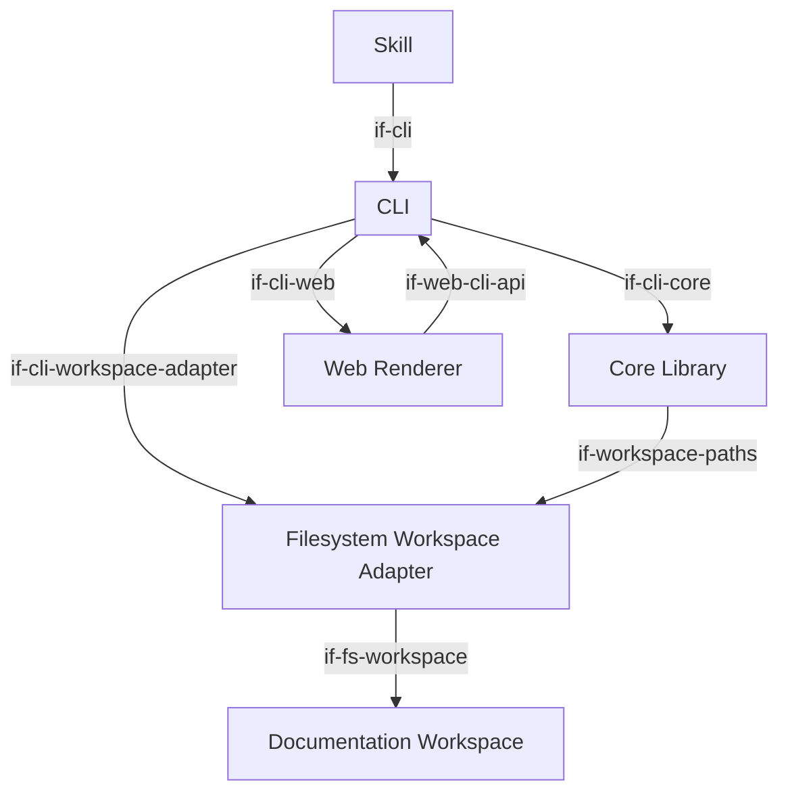
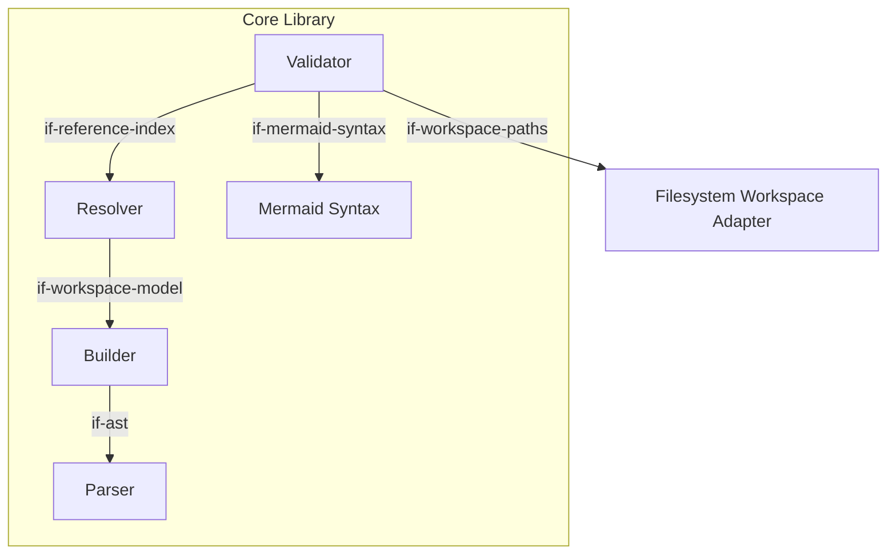
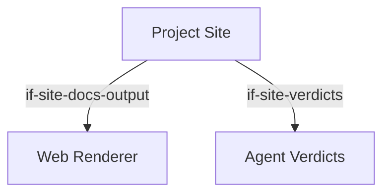

# Building Blocks

The biz42 toolchain is a pnpm monorepo. Each package is a vertical slice of the system —
the core library owns architecture processing; the CLI and skill are thin consumers of it. Each
building-block diagram uses one abstraction level: the overview shows peer/package-level blocks,
while a parent and its direct children appear only in that parent's adjacent drill-down.

The domain of this architecture documentation is the 12 biz42 ISO 9001 sections: scope, signal, expectation, risk, opportunity, objective, measure, owner, capability, product, evaluation, improvement. These are represented as 12 block types in the DSL.

```arc42
:::ignore H015 bb-renderer is a CLI-internal implementation detail; its containment in bb-cli via parent is sufficient — it does not need to appear in the overview diagram :::
:::diagram
id: diag-building-blocks
view: building-block
notation: mermaid
:::
```



The overview intentionally treats `@biz42/core` as opaque. Its internal responsibilities are
shown only in the Core Library drill-down below.

## Core Library

The business-model-processing heart of the system. It transforms already-acquired business model
documents into a typed model, resolves references, validates the model, and renders queries. It
does not discover files, read filesystem resources, select repository roots, or watch for changes.
Source acquisition belongs to workspace adapters; the processing pipeline is: parse Markdown →
build element model → index references → validate or render.

```arc42
:::building-block
id: bb-core
title: Core Library
technology: TypeScript / Node.js
implements: concept-pipeline, concept-rule-registry
requires: if-workspace-paths
:::
```

The Core Library is decomposed into one parent and its direct logical children. The children are
all internal responsibilities of the same package and are therefore not peer packages in the
overview.

```arc42
:::diagram
id: diag-core-drill-down
view: building-block
notation: mermaid
parent: bb-core
:::
```



### Core Library API

The Core Library provides its top-level API to the CLI as a workspace dependency. The CLI consumes
this contract for argument coordination, output formatting, and exit codes; the business logic
remains in Core Library.

```arc42
:::interface
id: if-cli-core
title: Core Library API
provider: bb-core
protocol: TypeScript module import (pnpm workspace:\*)
:::
```

---

### Markdown Parser

Reads acquired `.biz42.md` document content line by line and produces a `DocumentAst` — a sequence of heading,
prose, and block nodes with line numbers. Deliberately dumb: it emits all block types including
unknown ones. The meta-model builder rejects what it does not understand. This keeps the parser
stable as the block type set evolves.

```arc42
:::building-block
id: bb-parser
title: Markdown Parser
technology: TypeScript
parent: bb-core
implements: concept-pipeline
:::
```

#### Parser Output Contract

The parser produces `DocumentAst` structs consumed by the builder to construct the workspace model.

```arc42
:::interface
id: if-ast
title: Parser Output Contract
provider: bb-parser
protocol: In-process TypeScript function call
:::
```

### Meta-model Builder

Turns `DocumentAst[]` into a typed `Workspace` — a flat list of `Element` objects covering the 12 biz42 block types (scope, signal, expectation, risk, opportunity, objective, measure, owner, capability, product, evaluation, improvement), plus parse errors for missing or invalid required attributes. Unknown block types and structural problems are recorded as `ParseError` entries, which the E005 rule surfaces as diagnostics.

```arc42
:::building-block
id: bb-builder
title: Meta-model Builder
technology: TypeScript
parent: bb-core
implements: concept-pipeline
requires: if-ast
:::
```

#### Builder Output Contract

The builder produces a `Workspace`; the resolver consumes it to build the reference index.

```arc42
:::interface
id: if-workspace-model
title: Builder Output Contract
provider: bb-builder
protocol: In-process TypeScript function call
:::
```

### Reference Resolver

Builds a bidirectional reference index from the workspace: `byId` (id → element), `refsFrom`
(id → ids this element references), and `refsTo` (id → ids that reference this element). The index
also owns the canonical semantic edge representation used by query and payload consumers. It is
passed to every validation rule and to the `get` command for 1-hop relationship resolution.

```arc42
:::building-block
id: bb-resolver
title: Reference Resolver
technology: TypeScript
parent: bb-core
implements: concept-pipeline
requires: if-workspace-model
:::
```

#### Resolver Output Contract

The resolver produces a `ReferenceIndex`; the validator consumes it alongside the workspace, and
the `get` command uses it for 1-hop relationship resolution.

```arc42
:::interface
id: if-reference-index
title: Resolver Output Contract
provider: bb-resolver
protocol: In-process TypeScript function call
:::
```

### Validator

Runs all registered rules against the workspace and index. Each rule is a self-describing object
with metadata (code, severity, type, description, rationale, ISO 9001 section) and a `check()` function.
The validator is simply `builtinRules.flatMap(r => r.check(workspace, index))`. Rules that need
raw AST access use `workspace.documents`.

```arc42
:::building-block
id: bb-validator
title: Validator
technology: TypeScript
parent: bb-core
implements: concept-pipeline, concept-rule-registry
requires: if-reference-index, if-mermaid-syntax, if-workspace-paths
:::
```

### Mermaid Syntax

A thin wrapper around the upstream `mermaid` npm package that exposes a Node-compatible,
tree-shaken syntax check for Mermaid diagrams. Kept as a separate package to isolate the
large Mermaid bundle from the rest of the toolchain. The Validator uses it for W017 (invalid
Mermaid syntax) without bundling the full browser-oriented Mermaid runtime into `@biz42/core`.

```arc42
:::building-block
id: bb-mermaid
title: Mermaid Syntax
technology: TypeScript / Node.js
parent: bb-core
:::
```

#### Mermaid Syntax Contract

The Validator calls the Mermaid Syntax building block to parse and validate diagram syntax.

```arc42
:::interface
id: if-mermaid-syntax
title: Mermaid Syntax Contract
provider: bb-mermaid
protocol: In-process TypeScript function call
:::
```

## Filesystem Workspace Adapter

Provides the filesystem-backed workspace boundary used by the CLI. It discovers architecture
documents, reads their contents, establishes repository-root context, and performs validations that
depend on filesystem paths. Other acquisition mechanisms, such as web resources, can provide their
own adapters without expanding the responsibilities of the architecture-processing core. File
watching and workspace-directory selection remain CLI responsibilities. No separate child
building blocks are modeled here because discovery, loading, and path evidence form one cohesive
adapter boundary at this architectural level.

```arc42
:::building-block
id: bb-workspace-fs
title: Filesystem Workspace Adapter
technology: TypeScript / Node.js
implements: concept-pipeline
requires: if-fs-workspace
:::
```

### Filesystem Adapter Contract

The CLI selects the workspace directory and delegates filesystem-backed discovery, loading, and
path-context operations to the filesystem workspace adapter. File watching remains a CLI concern.

```arc42
:::interface
id: if-cli-workspace-adapter
title: Filesystem Adapter Contract
provider: bb-workspace-fs
protocol: TypeScript module import
:::
```

### Workspace Path Context

The filesystem workspace adapter computes path evidence (`knownPaths`, repository root) and
pre-aggregated coverage from the git-tracked file inventory, and injects both into
`ValidationContext` before passing it to the validator.

```arc42
:::interface
id: if-workspace-paths
title: Workspace Path Context
provider: bb-workspace-fs
protocol: In-process TypeScript function call
:::
```

### Workspace Diff Contract

The filesystem workspace adapter acquires the git diff — base and current documents, changed
file hunks, and known paths — and passes them to the Architecture Diff building block for
analysis. This is a filesystem concern; the diff analysis itself is pure and source-independent.

```arc42
:::interface
id: if-workspace-diff
title: Workspace Diff Contract
provider: bb-workspace-fs
protocol: In-process TypeScript function call
:::
```

## CLI

A thin entry point over the core library and workspace adapters. Parses arguments with Node.js
`util.parseArgs` (no third-party parser), resolves the workspace directory (`--dir` flag →
`$BIZ42_DIR` → cwd), and coordinates the selected workspace adapter with core processing. Implements
commands: `validate`, `get`, `rules`, `serve`, `build`, `init`, and `explain`. At build time, the CLI copies the compiled `@biz42/web`
SPA assets into its own `dist/web/` directory (multi-file) and `dist/web-single/` directory (single self-contained HTML file) so they can be served statically or shared as a single file.

```arc42
:::building-block
id: bb-cli
title: CLI
technology: TypeScript / Node.js
implements: concept-pipeline
requires: if-cli-core, if-cli-workspace-adapter, if-cli-web
:::
```

### Renderer Registry

Produces human-readable text or JSON from `biz42 get` query results. Each renderer implements
the `GetRenderer` interface; the registry (`builtinGetRenderers`, `rendererById`) mirrors the
rule registry pattern. Moved here from core because rendering is a CLI output concern, not part
of the core processing pipeline.

```arc42
:::building-block
id: bb-renderer
title: Renderer Registry
technology: TypeScript
parent: bb-cli
implements: concept-rule-registry
:::
```

#### Renderer Output Contract

The CLI passes element query results to the renderer registry to produce text, JSON, or Markdown output.

```arc42
:::interface
id: if-renderer
title: Renderer Output Contract
provider: bb-renderer
protocol: In-process TypeScript function call
:::
```

### CLI Command Interface

Architects, AI agents, CI pipelines, and the skill invoke the CLI commands provided by this
building block.

```arc42
:::interface
id: if-cli
title: CLI Command Interface
provider: bb-cli
protocol: CLI commands via terminal, Bash, or CI process
:::
```

### CLI Workspace API

The web renderer fetches the workspace payload from the CLI's HTTP API endpoint (`/api/workspace`).
The CLI obtains that payload through its Core Library boundary. In the static export case the
payload is a JSON file generated during the CLI/web build.

```arc42
:::interface
id: if-web-cli-api
title: CLI Workspace API
provider: bb-cli
protocol: HTTP JSON (serve) or static JSON file (export)
:::
```

## Opencode Skill

A single `SKILL.md` file that orients AI agents to the biz42 convention. Not code —
it establishes the expectation that every business model change is reflected in the `.biz42.md`
files, and points agents at the CLI to discover current state and rules. Installed by copying to
`~/.opencode/skills/biz42/SKILL.md`.

```arc42
:::building-block
id: bb-skill
title: Opencode Skill
technology: Markdown
implements: concept-prose-first
requires: if-cli
:::
```

### Skill Guide Contract

The agent loads the installed skill to obtain the authoring convention and validation workflow.

```arc42
:::interface
id: if-agent-skill
title: Skill Guide Contract
provider: bb-skill
protocol: SKILL.md loaded at agent startup
:::
```

## Web Renderer

A browser-side single-page application that renders biz42 documentation as a navigable web UI.
Reads workspace data from the core library via an HTTP API (when served by the CLI) or from a
baked-in JSON file (when published as a static site). Presents prose and DSL blocks together:
prose is shown as formatted text; biz42 element blocks are revealed by clicking a coloured
stripe; Mermaid diagrams are rendered inline. An Agent view toggle shows raw DSL fences for
tooling consumers. Designed to work equally as a `localhost` server and as a GitHub Pages
static deployment.

```arc42
:::building-block
id: bb-web-renderer
title: Web Renderer
technology: TypeScript / React / Vite
implements: concept-prose-first
requires: if-web-cli-api
:::
```

### Web Renderer UI

The reader opens the rendered architecture documentation in a browser.

```arc42
:::interface
id: if-reader-web
title: Web Renderer UI
provider: bb-web-renderer
protocol: HTTP / browser
:::
```

### Web Renderer Hosting Contract

The CLI hosts the web renderer as a local HTTP server. On `biz42 serve`, it builds the workspace
payload via the core library, exposes it at `/api/workspace`, and serves the web renderer's static
assets.

```arc42
:::interface
id: if-cli-web
title: Web Renderer Hosting Contract
provider: bb-web-renderer
protocol: HTTP (localhost) — static assets + JSON API
:::
```

### Rendered Docs Build Output

The web renderer is built with `biz42 build` and its static output (`dist/`) is co-deployed with
the project site under the `/docs/` sub-path on GitHub Pages. The project site links to this output
— it does not embed or rebuild it. The interface boundary is the build artifact directory.
`biz42 build --single-file` produces a self-contained `index.html` (all JS/CSS inlined) suitable
for `file://` sharing without CORS errors.

```arc42
:::interface
id: if-site-docs-output
title: Rendered Docs Build Output
provider: bb-web-renderer
protocol: Static build artifact (HTML/JS/CSS at dist/)
:::
```

## biz42 Documentation Workspace

The set of `.biz42.md` files that make up a project's business model documentation.
Written by business architects and AI agents, read by architects, workspace adapters, and CI pipelines.
They are the input to the toolchain and the primary human-readable output it produces and maintains.

```arc42
:::building-block
id: bb-workspace
title: biz42 Documentation Workspace
technology: Markdown (.biz42.md files)
implements: concept-prose-first, concept-pipeline
:::
```

### Documentation Workspace Access

Business architects and AI agents both read and write the Markdown workspace — architects via an editor
or review workflow, agents via file tools. The contract is the same: a directory of `.biz42.md`
files that can be read, written, and validated.

```arc42
:::interface
id: if-workspace-access
title: Documentation Workspace Access
provider: bb-workspace
protocol: File Read/Write (editor or file tools)
:::
```

### Documentation Workspace Contract

The filesystem workspace adapter reads `.biz42.md` files from the selected documentation workspace
and supplies their contents and filesystem context to the core processing pipeline.

```arc42
:::interface
id: if-fs-workspace
title: Documentation Workspace Contract
provider: bb-workspace
protocol: File system read (discovery + file content)
:::
```

## Project Site

A static marketing and documentation website aimed at non-users who want to understand what
the biz42 toolchain does and why they might adopt it. Built with React and Vite-Plus;
deployed to GitHub Pages. Shows a hero section, a feature strip, live examples (the tool's
own biz42 workspace and a bookstore sample), and agent verdict cards sourced from
`docs/verdicts`. Not part of the installed toolchain — it is informational only and is
never shipped as an npm package.

```arc42
:::building-block
id: bb-site
title: Project Site
technology: TypeScript / React / Vite
requires: if-site-verdicts, if-site-docs-output
:::
```

```arc42
:::diagram
id: diag-site
view: building-block
notation: mermaid
:::
```



### Project Site Web Interface

The static website deployed to GitHub Pages. Potential adopters and stakeholders browse it
to understand the toolchain's purpose, see live examples, and review agent verdict cards.

```arc42
:::interface
id: if-site-web
title: Project Site (GitHub Pages)
provider: bb-site
protocol: HTTPS / static HTML
:::
```

## Agent Verdicts

A directory of structured Markdown files that record evaluations of AI agent runs against
the biz42 toolchain. Each file has YAML frontmatter (model, agent, harness, date,
task, version, title, tldr) and a free-form body. Consumed at build time by the Project Site;
not part of the installed toolchain. The verdicts are the primary evidence base for
communicating agent compatibility to potential adopters.

```arc42
:::building-block
id: bb-verdicts
title: Agent Verdicts
technology: Markdown
:::
```

### Verdicts Vite Plugin Contract

The site reads verdict frontmatter from `docs/verdicts` at build time through a custom Vite
plugin that exposes the parsed list as a virtual module. The interface boundary is a build-time
Vite plugin; no runtime network calls are involved.

```arc42
:::interface
id: if-site-verdicts
title: Verdicts Vite Plugin Contract
provider: bb-verdicts
protocol: Vite virtual module (build-time Markdown → JSON)
:::
```
