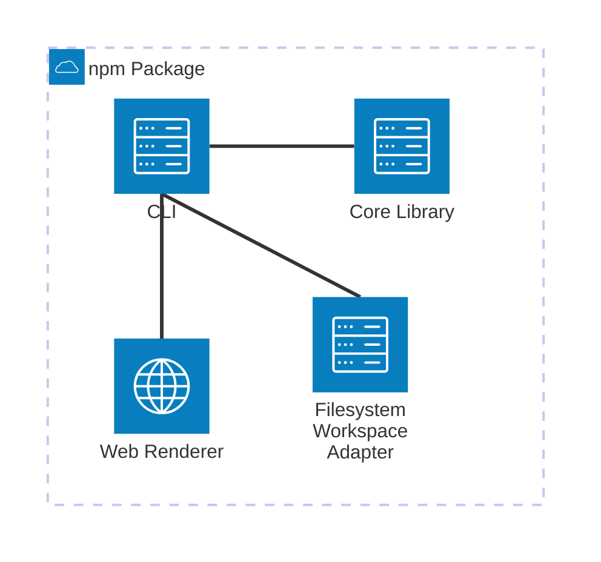

# Deployment View

## Deployment overview

The biz42 toolchain ships as three independent deployment units: the npm-distributed
toolchain packages, the opencode skill, and the author's own biz42 documentation workspace. The
overview intentionally stays at deployment-unit level; the npm package contents are detailed below.
There is no server, cloud infrastructure, or network dependency beyond npm for installation.

```arc42
:::diagram
id: biz42-deployment
view: deployment
notation: mermaid-architecture
aliases: npm_packages=bb-cli, agent_skill=bb-skill, documentation_workspace=bb-workspace
:::
```


## npm-distributed Toolchain Packages

The CLI, pure core library, filesystem workspace adapter, and web renderer are distributed as
cooperating npm packages. The web renderer's compiled static assets are served directly by the CLI.
There is no separate deploy step — the packages are consumed directly from the npm registry.

```arc42
:::deployment-node
id: node-npm-package
title: npm-distributed Toolchain Packages
type: server
hosts: bb-cli, bb-core, bb-parser, bb-builder, bb-resolver, bb-validator, bb-renderer, bb-mermaid, bb-workspace-fs, bb-web-renderer
:::
```

```arc42
:::diagram
id: biz42-npm-package
view: deployment
notation: mermaid-architecture
roots: node-npm-package
aliases: node_npm_package=node-npm-package, bb_cli=bb-cli, bb_core=bb-core, bb_workspace_fs=bb-workspace-fs, bb_web_renderer=bb-web-renderer
:::
```



## Agent Skill

The skill is a single `SKILL.md` file (and its companion templates) installed by file copy into
the AI agent's skills directory, typically `~/.opencode/skills/biz42/`. The agent reads
it at session start. No build step or runtime environment is required; Markdown is the only
technology.

```arc42
:::deployment-node
id: node-skill
title: Agent Skill Directory
type: device
hosts: bb-skill
:::
```

## biz42 Documentation Workspace

The `.biz42.md` files live wherever the project's source code lives — a local checkout, a CI
container, or any filesystem the CLI can read. The workspace is not bundled with the toolchain;
it is supplied by the author per project.

```arc42
:::deployment-node
id: node-workspace
title: biz42 Documentation Workspace
type: device
hosts: bb-workspace
:::
```

## Project Site

The project site and the agent verdicts it reads are deployed independently as a GitHub Pages
static site. They are not part of the installed toolchain. `bb-verdicts` is physically
co-located with the rest of the repository but treated as a separate deployment concern.

```arc42
:::deployment-node
id: node-site
title: GitHub Pages (Project Site)
type: server
hosts: bb-site, bb-verdicts
:::
```
