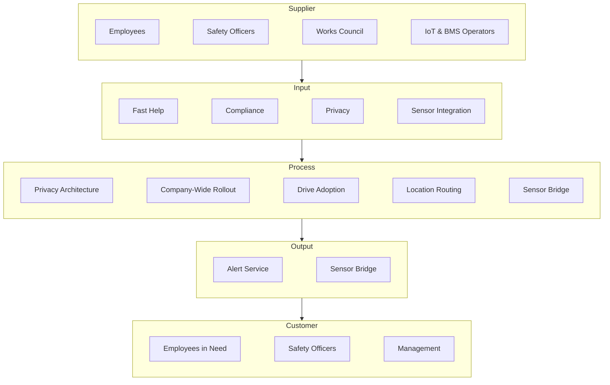

# Scope

ACME Emergency Response reliably does one job best: Alert when somebody's in need.

```biz42
:::scope
id: scope-acme
title: ACME Emergency Response
included: DACH region, B2B for large companies, start as intrapeneuer
excluded: Crisis communication, public alerting
:::
```

## 1.1 Included

ACME Emergency provides location-based emergency alerting for large
organizations with distributed sites and mobile assets. When someone needs
help, the nearest person who can assist is notified — within seconds, not
after a chain of phone calls.

- **Customers:** large B2B organizations operating buildings, industrial
  facilities, and moving assets (e.g. vehicle fleets, rolling stock).
- **Market:** DACH region (Germany, Austria, Switzerland).
- **Starting position:** internal build within a single large organization,
  with potential to spin out as an external product.

## 1.2 Excluded

- **Crisis management** — we alert the nearest helper, we don't manage the
  incident. Full crisis communication and escalation workflows remain with
  existing enterprise notification systems.
- **Emergency dispatch** — we don't integrate 112 or dispatch professional
  emergency services.
- **Public alerting** — this is a workplace service, not a public warning system.
- **Non-DACH markets** — until the core product is proven internally.

## 1.3 Boundaries

- **Existing enterprise notification system** — handles organization-wide
  crisis communication. ACME Emergency handles fast, local, proximity-based alerts.
- **Positioning infrastructure** — we consume location data from existing
  systems. We don't install or operate positioning hardware.
- **Sensor and building systems** — we receive events from existing IoT and
  building management systems.

## 1.4 Process Overview

The SIPOC diagram maps the alerting process end-to-end: from the stakeholders
who supply the need, through what they bring as inputs, to the process the
organisation runs, the products it delivers, and who receives the value.
It makes the scope concrete by showing what is inside (Process, Output) and
what is outside (Supplier, Customer).

:::diagram
id: diagram-sipoc-alerting
title: Alerting Process — SIPOC Overview
notation: sipoc
:::


