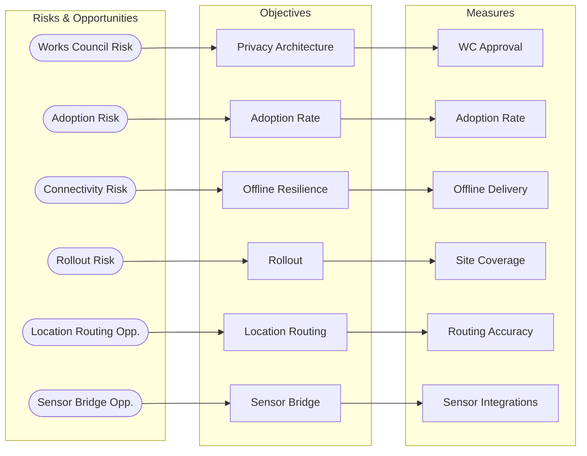

# Objectives

## Strategic Overview

The strategy map below shows why each objective exists (the risk or opportunity
it addresses) and how success is measured. Arrows read as cause-and-effect:
a risk or opportunity drives an objective, which is tracked by a measure.

:::diagram
id: diagram-strategy-map
title: Strategy Map — Objectives and Their Causes
notation: strategy-map
:::



## Privacy Architecture Approved by Works Council

Design a privacy model for location-based alerting that satisfies the works
council's requirements: no continuous tracking, location processed only during
active alert situations, transparent data lifecycle, genuinely voluntary
participation. Obtain formal works council approval before any deployment.

Target: works council approval (formal Betriebsvereinbarung signed).
Deadline: month 3 (blocks everything else).

```biz42
:::objective
id: obj-privacy-architecture
title: Privacy Architecture Approved by Works Council
addresses: risk-works-council
measured-by: measure-works-council-approval
owner: owner-product-lead
requires: capability-location-routing
:::
```

## Time to Deployment

Deploy the alert service company-wide across all static sites (offices,
stations, workshops, depots) within 12 months. The 12-month window is a
constraint, not a wish.

Target: service live on ≥90% of static sites.
Deadline: 12 months from project start.

```biz42
:::objective
id: obj-time-to-deployment
title: Time to Deployment — Company-Wide Rollout in 12 Months
addresses: risk-rollout-timeline, risk-incumbent-response, risk-reputational, opp-internal-mandate, opp-cost-effective-alerting
measured-by: measure-site-coverage
owner: owner-project-lead
requires: capability-alert-delivery, capability-platform-integration
:::
```

## Adoption Rate

Achieve ≥60% voluntary participation among employees at deployed sites
within 3 months of each site going live.

Target: ≥60% active participation per site within 3 months of site launch.

```biz42
:::objective
id: obj-adoption-rate
title: Adoption Rate ≥60% Per Site
addresses: risk-adoption, opp-device-based-alerting
measured-by: measure-adoption-rate
owner: owner-product-lead
:::
```

## Location-Based Routing

Deliver alerts to the nearest available person rather than broadcasting to a list.
The first responder notified should be in the immediate vicinity of the alerter.

Target: ≥80% of alerts route to a responder in the same building zone.

```biz42
:::objective
id: obj-location-routing
title: Location-Based Alert Routing
addresses: opp-location-routing
measured-by: measure-routing-accuracy
owner: owner-tech-lead
requires: capability-location-routing
:::
```

## Moving-Asset Alerting

Extend alerting to rolling stock and vehicles. An employee on a moving asset
can trigger an alert, and the system routes it to the nearest person on the
same asset.

Target: alerting functional on ≥3 moving-asset types.
Deadline: month 9.

```biz42
:::objective
id: obj-moving-assets
title: Moving-Asset Alerting Operational
addresses: opp-moving-asset-alerting
measured-by: measure-moving-asset-coverage
owner: owner-tech-lead
requires: capability-location-routing, capability-asset-integration
:::
```

## Offline Resilience

The system must remain functional in environments without reliable network
connectivity: tunnels, basements, shielded areas.

Target: alert delivery functional in offline/degraded network conditions.
Deadline: month 6.

```biz42
:::objective
id: obj-offline-resilience
title: Offline Alert Delivery in Connectivity-Challenged Environments
addresses: risk-connectivity
measured-by: measure-offline-delivery
owner: owner-tech-lead
requires: capability-alert-delivery
:::
```

## Sensor Bridge

Enable IoT sensors and building management systems to trigger alerts automatically.
Priority: sensor types with the highest life-safety impact (gas, fire detection).

Target: ≥2 sensor types triggering alerts in production.
Deadline: month 10.

```biz42
:::objective
id: obj-sensor-bridge
title: Sensor-Triggered Alerting Operational
addresses: opp-sensor-bridge
measured-by: measure-sensor-integrations
owner: owner-tech-lead
requires: capability-sensor-ingestion
:::
```
