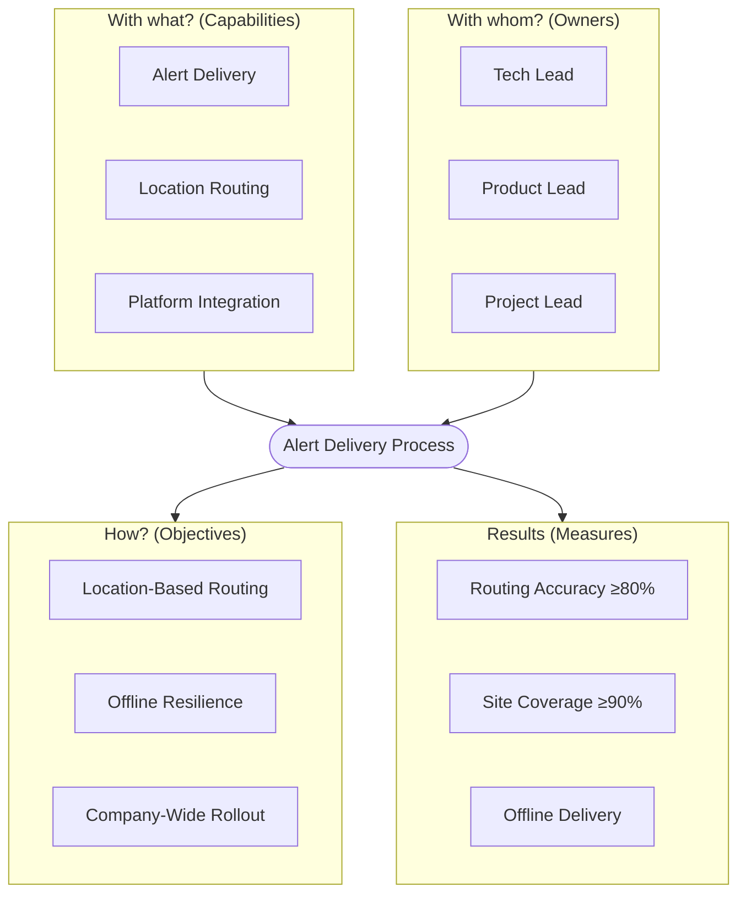

# Capabilities

## Alert Delivery Process Audit

The turtle diagram audits the alert delivery process against six questions:
what resources it needs, who is accountable, what objectives it must achieve,
who benefits, and what measures define success.

:::diagram
id: diagram-turtle-alert-delivery
title: Alert Delivery — Process Audit
notation: turtle
:::



## Alert Delivery

The ability to deliver alerts from any source (human or machine) to nearby
recipients within seconds, across multiple channels. Must remain functional
under peak load and in environments with degraded or no network connectivity.

Connectivity in challenging environments (tunnels, basements, shielded areas)
is the highest-risk technical unknown.

```biz42
:::capability
id: capability-alert-delivery
title: Alert Delivery
status: planned
enables: product-alert-service, product-sensor-bridge
owner: owner-tech-lead
:::
```

## Location Routing

The ability to determine which people are nearest to an alert source and
route the alert to them. The critical constraint is privacy: location must
be processed only during active alert situations, never stored for tracking.

```biz42
:::capability
id: capability-location-routing
title: Location Routing
status: gap
enables: product-alert-service
owner: owner-tech-lead
:::
```

## Asset Integration

The ability to resolve "which people are on this moving asset right now?" by
combining voluntary check-in with existing asset tracking systems.

```biz42
:::capability
id: capability-asset-integration
title: Asset Integration
status: gap
enables: product-alert-service
owner: owner-tech-lead
:::
```

## Sensor Ingestion

The ability to receive events from heterogeneous IoT sensor and building
management systems and convert them into alert triggers — without a human
in the loop.

```biz42
:::capability
id: capability-sensor-ingestion
title: Sensor Ingestion
status: gap
enables: product-sensor-bridge
owner: owner-tech-lead
:::
```

## Platform Integration

The ability to work within the organization's existing IT landscape: identity
management, device management, corporate network, and the existing enterprise
notification system.

```biz42
:::capability
id: capability-platform-integration
title: Platform Integration
status: exists
enables: product-alert-service
owner: owner-tech-lead
:::
```
