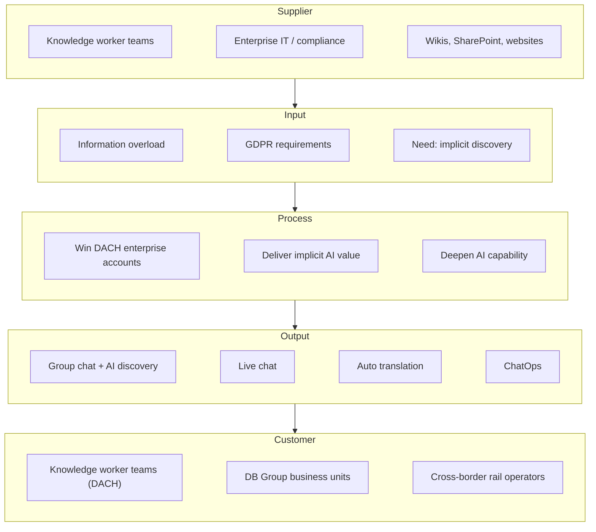

# Scope

Assistify was a DACH-focused, GDPR-compliant group chat platform for knowledge worker teams in IT and large enterprises. Its core purpose was to accelerate inter-human communication by using AI to implicitly surface relevant knowledge from ongoing group conversations — without requiring users to explicitly search or tag content. Adjacent systems such as wikis, SharePoint sites, and public websites fed into the knowledge discovery layer. Slack was the primary competitor; its status as a US-hosted SaaS made it non-compliant with many corporate and GDPR policies, which was a key differentiator for Assistify. 1:1 messaging was technically possible but not the core use case. Document management, task tracking, and voice/video communication were out of scope.

```biz42
:::scope
id: scope-assistify
title: Assistify
included: group chat for knowledge worker teams, AI-powered implicit knowledge discovery, DACH market, IT teams and enterprise sub-teams, GDPR-compliant deployment, integration with wikis / SharePoint / websites
excluded: 1:1 private messaging (incidental only), document management and file versioning, project and task management, voice and video communication, markets outside DACH
:::
```

The SIPOC below maps Assistify's core value delivery process from the external inputs that feed into the platform to the knowledge workers and enterprise teams who receive the outputs.

```biz42
:::diagram
id: diagram-sipoc
title: Assistify SIPOC
notation: sipoc
:::
```


